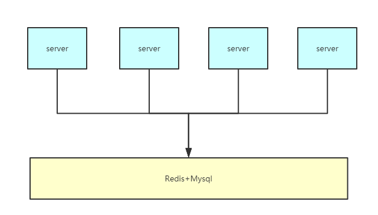

# Mimarket_AWS_ver

SecKill Homework 

## Directory

```
+
|
+- Control # sec kill controller/redis server
|
+- Db # data base code
|
+- Redis # redis handle
|
+- static # some static resource(now we use to restore html resource)
|    |
|    + - css 
|    |
|    + - images
|    |
|    + - js
|
+ - templates # now we use to restore html
|
+ - main.py # [TODO]: main logic, it may be translated to another directory
|
+ - views # [TODO]: saving views resource
```

### Workflow


 * Each midware server run in a container, and they will communicate with redis server to sync data
 * Redis server cache the request, and save it into database


## Target

  - [x] Basic web server work
  - [ ] Communicate with database
  - [x] Communicate with redis
  - [x] Build it in docker
  - [ ] Migrate to distributed-ver